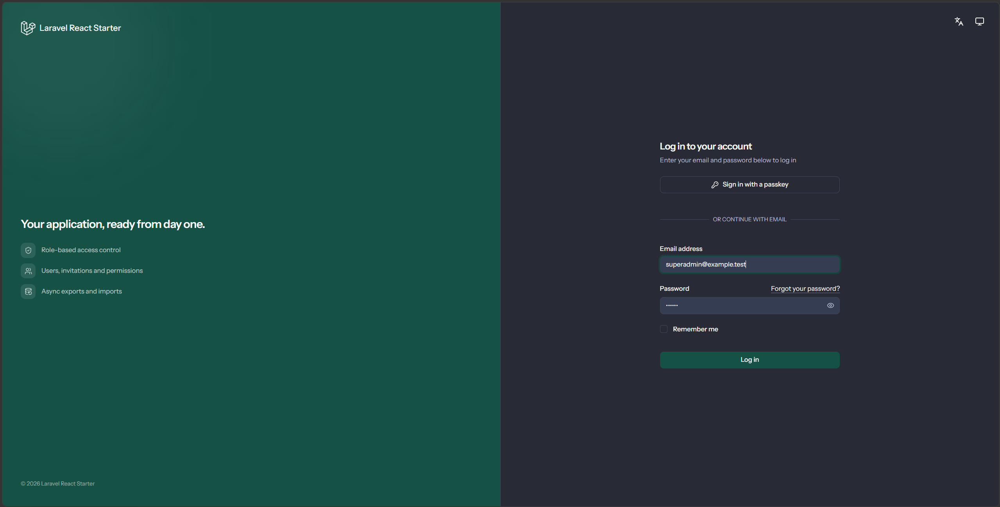
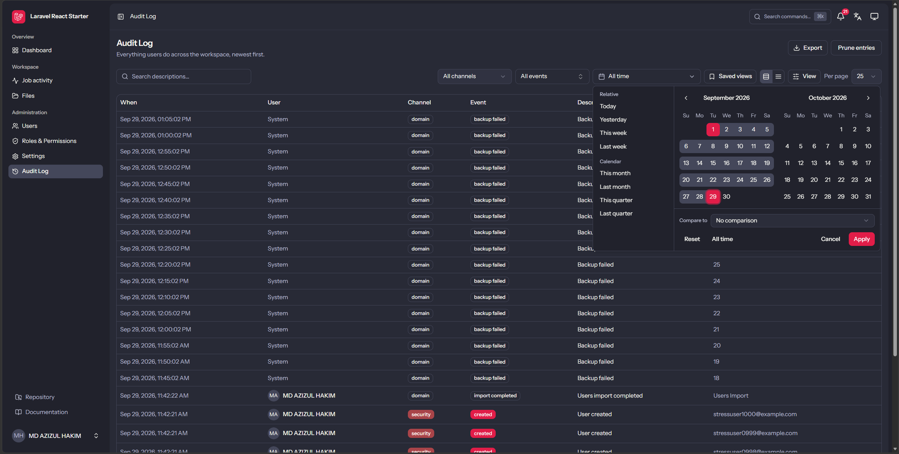

# Laravel React Inertia Starter Kit

[](https://github.com/AHS12/laravel-react-inertia-starter-kit/actions/workflows/tests.yml)
[](LICENSE)


A **production-ready Laravel + Inertia/React starter kit**: authentication
(Fortify, 2FA, passkeys), RBAC, user/role management, settings, notifications,
media, an async export/import Data Processing Center, a full audit trail,
scheduled backups with optional S3/R2 off-site storage, a first-run setup
wizard and developer tools — wired together with a strict Service–Repository
architecture so product work can start on day one. Ships with 5-language
internationalization (English, Bangla, French, German, Spanish).

<!-- 📸 Screenshots: drop the two images into docs/images/ as
     screenshot-1.png and screenshot-2.png (or update the paths below). -->

<p align="center">
  
&nbsp;
  
</p>

## Highlights

- **Fortify authentication** — registration, email verification, password
  reset, two-factor auth and passkeys
- **RBAC** — Super Admin / Admin / Member system roles with a permission
  registry
- **User & role management**, including email invitations
- **Settings** — general, mail, appearance, per-user profile and security
- **Notifications** — in-app notification center with per-user preferences
- **Media & file uploads** via `spatie/laravel-medialibrary`
- **Audit trail** — "who did what" logging, browsable at `/audit-logs`, with
  retention settings and export
- **Async exports & imports** — a Data Processing Center (`/activity`)
  tracking queued jobs with live progress and artifact download
- **Scheduled backups** — `spatie/laravel-backup` with a settings-driven
  schedule, run history, health checks and an optional S3/R2 off-site
  destination ([docs/backups.md](docs/backups.md))
- **Developer tooling** — Telescope, Pulse, Horizon and health checks
- **First-run browser installer** at `/setup` — configure everything without
  touching `.env` by hand
- **Internationalization** — 5 locales out of the box

## Tech stack

| Layer       | Technology                                                   |
| ----------- | ------------------------------------------------------------ |
| Backend     | Laravel, PHP 8.3+ (Service–Repository architecture)          |
| Frontend    | Inertia + React 19 + TypeScript, Tailwind CSS 4, shadcn/ui   |
| Database    | PostgreSQL (recommended), MySQL/MariaDB, or SQLite           |
| Cache/Queue | Redis when available, otherwise file/database drivers        |
| Auth        | Laravel Fortify                                              |
| Exports     | maatwebsite/excel, queued jobs                               |

## Quick start

Requirements: PHP 8.3+, Composer 2, Node.js `^20.19.0 || >=22.12.0`, and a
database (SQLite works with zero setup).

```sh
git clone https://github.com/AHS12/laravel-react-inertia-starter-kit.git
cd laravel-react-inertia-starter-kit
composer setup     # deps, .env, key, drivers, migrate + seed, assets
composer run dev   # server + queue worker + Vite
```

Open <http://localhost:8000> and log in with the seeded super admin
(local/testing only):

```
Email:    superadmin@example.test
Password: 123456
```

Prefer a guided setup? Serve the app and open **`/setup`** — the browser
installer walks through environment checks, database configuration,
migrations, driver detection and super admin creation.

> Local dev is even smoother with a tool like **Laravel Herd**,
> **Lerd**, **Laragon** or **EnvKit** — see
> [docs/installation.md](docs/installation.md).

## Documentation

Full guides live in [`docs/`](docs/README.md):

| Guide                                            | What it covers                          |
| ------------------------------------------------ | --------------------------------------- |
| [Getting started](docs/getting-started.md)        | Install, boot, first login               |
| [Installation](docs/installation.md)              | Setup details + local env tools          |
| [Configuration](docs/configuration.md)            | `.env`, drivers & Redis, mail, queues    |
| [Backups](docs/backups.md)                        | Scheduled backups, S3/R2 destinations, restore runbook |
| [Architecture](docs/architecture.md)              | Service–Repository, project structure    |
| [Testing](docs/testing.md)                        | Pest, the quality gate, git hooks        |
| [Translations](docs/translations.md)              | The 5-locale i18n layer                  |
| [Troubleshooting](docs/troubleshooting.md)        | Common problems and fixes                |
| [UI conventions](docs/ui-conventions.md) | Motion, feedback, charts and accessibility conventions |
| [Accessibility](docs/accessibility.md) | Keyboard/focus/contrast audit and high-contrast tokens |

## Contributing

Contributions are welcome! See [CONTRIBUTING.md](CONTRIBUTING.md) for the
workflow, conventions and the required quality gate (`composer check`).
Please note our [Code of Conduct](CODE_OF_CONDUCT.md). Security
vulnerabilities are handled privately — see [SECURITY.md](SECURITY.md).

## License

Released under the [MIT License](LICENSE).
